# 🦖 Silent Exposure — CTF Write-Up

---

## 📌 Descripción

Este reto simula una intrusión en la organización **InGen**, donde un atacante ha comprometido uno de sus servidores principales.

🎯 **Objetivo:**
- Reconstruir el ataque  
- Identificar vulnerabilidades  
- Analizar cómo se evadieron los controles de seguridad  

---

## 🧭 Índice

- [1. HTTP](#-1-http)
- [2. Fuzzing](#-2-fuzzing)
- [3. Data Breach](#-3-data-breach)
- [4. GPG Keys](#-4-gpg-keys)
- [5. Acceso al Host](#-5-acceso-al-host)
- [6. Análisis del Sistema](#-6-análisis-del-sistema)
- [🏁 Conclusión](#-conclusión)

---

## Apartado 1: HTTP

### Contexto
Revisar el sitio web de una organización es uno de los primeros pasos en cualquier auditoría de seguridad. A través de él se puede detectar tecnología utilizada, configuraciones inseguras, información expuesta involuntariamente o posibles puntos de entrada para un atacante.

### Preguntas y respuestas

- **¿A través de qué puerto se comunica el servidor?**  
  El servidor se comunica a través del puerto **80**, que es el puerto estándar para el protocolo HTTP.

- **¿Qué protocolo se está utilizando para la transferencia de información?**  
  Se utiliza el protocolo **HTTP** (HyperText Transfer Protocol), en su versión sin cifrado.

- **¿Cuál es el título de la página?**  
  El título de la página es **Security Warning Simulation**.

- **¿Cuál es el Error code?**  
  El código de error encontrado es **SEC_ERROR_UNKNOWN_ISSUER**, lo que indica que el certificado SSL/TLS presentado por el servidor no es reconocido por el navegador.

- **¿Cuál es la razón del error?**  
  La razón del error es que se trata de un **certificado autofirmado o no confiable** (Self-signed / untrusted certificate). Esto significa que el certificado no ha sido emitido por una Autoridad Certificadora (CA) reconocida.

- **¿Cómo se llama el fichero descargado?**  
  El fichero descargado se llama **wordlist.txt**.

- **¿Cuál es la FLAG?**  
  La flag obtenida en este apartado es: `Bienvenidos a Jurassic Park`

---

## Apartado 2: Fuzzing

### Contexto
El **fuzzing** o fuzz testing es una técnica automatizada que consiste en enviar entradas inesperadas o malformadas a una aplicación para detectar fallos, errores o vulnerabilidades. En el contexto web, se utiliza para descubrir rutas, directorios y ficheros ocultos en un servidor.  
Se emplearon dos herramientas para este apartado: `dirb` y `Gobuster`.

### Preguntas y respuestas

  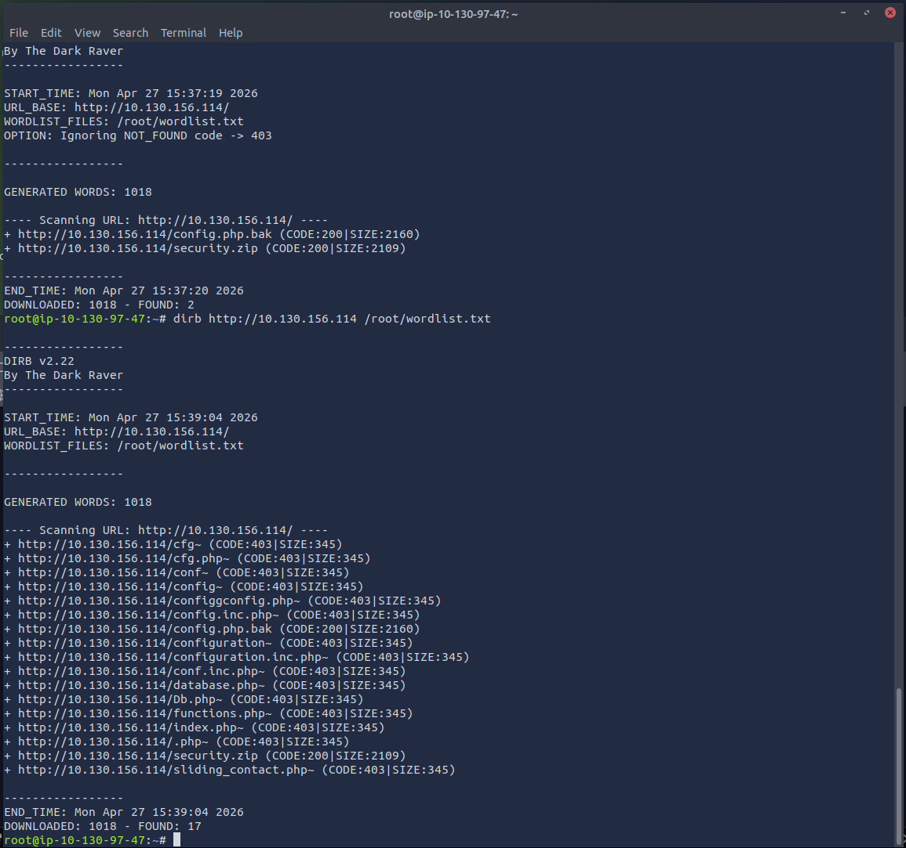

- **¿Cuántos ficheros tiene el servidor con dirb?**  
  Con la herramienta `dirb` se detectaron **17** ficheros en el servidor.

  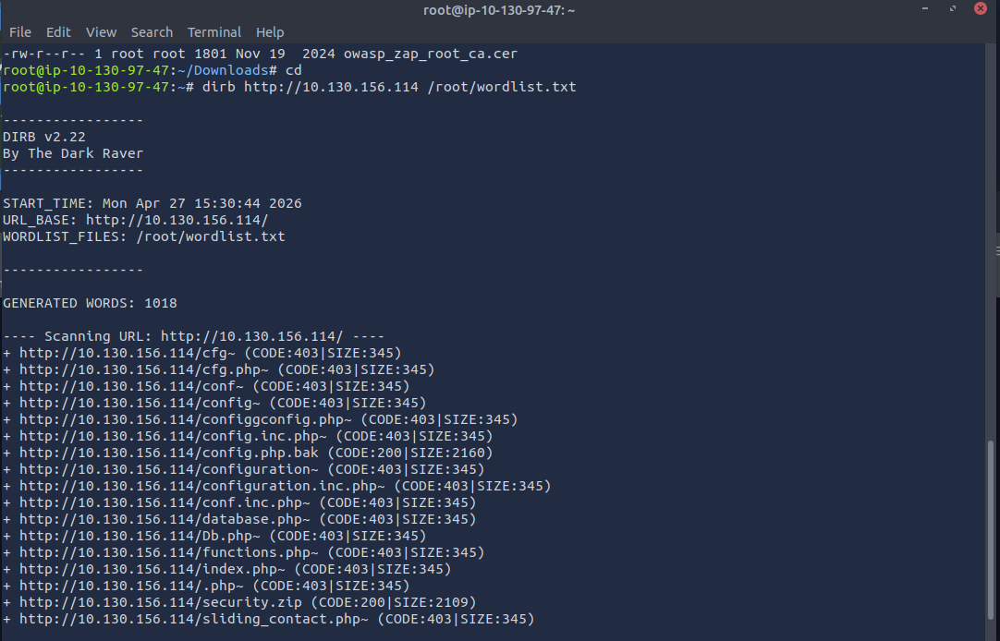
  Ese comando es como enviar a un mensajero a llamar a todas las puertas de un edificio para ver cuáles están abiertas.
  **dirb:** Es la herramienta que hace el trabajo sucio. Su función es buscar carpetas o páginas ocultas en una web.
  **http://10.130.156.114:** Es la dirección de la "casa" (el servidor) que estamos inspeccionando.
  **/root/wordlist.txt:** Es un diccionario. Contiene miles de palabras "admin", "config", "backup", etc.

- **¿Cuántos ficheros tiene el servidor con Gobuster?**  
  Con la herramienta `Gobuster` se detectaron **32** ficheros, ya que permite una exploración más exhaustiva gracias a sus opciones de configuración.

  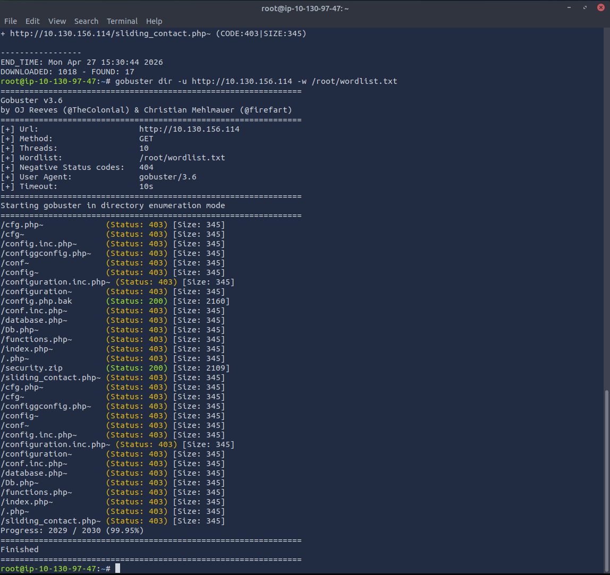
  **gobuster dir:** Es la herramienta, el modo dir (directorio) para buscar rutas ocultas en una web.
  **-u http://10.130.156.114:** La U de URL. Es el objetivo a explorar.
  **-w /root/wordlist.txt:** La W de Wordlist. Es el diccionario de palabras que el programa va a probar.
  

- **¿Cuál es el código correcto?**  
  El código HTTP que indica que un recurso existe y es accesible es el **200 (OK)**.

- **¿Cuál es el código de error?**  
  El código de error encontrado es el **403 (Forbidden)**, que indica que el servidor entiende la solicitud pero rechaza el acceso al recurso.

- **¿Cuál es la flag para que no muestre los ficheros erróneos en dirb?**  
  La flag utilizada en `dirb` para filtrar y no mostrar los resultados con código 403 es: **`-N 403`**

 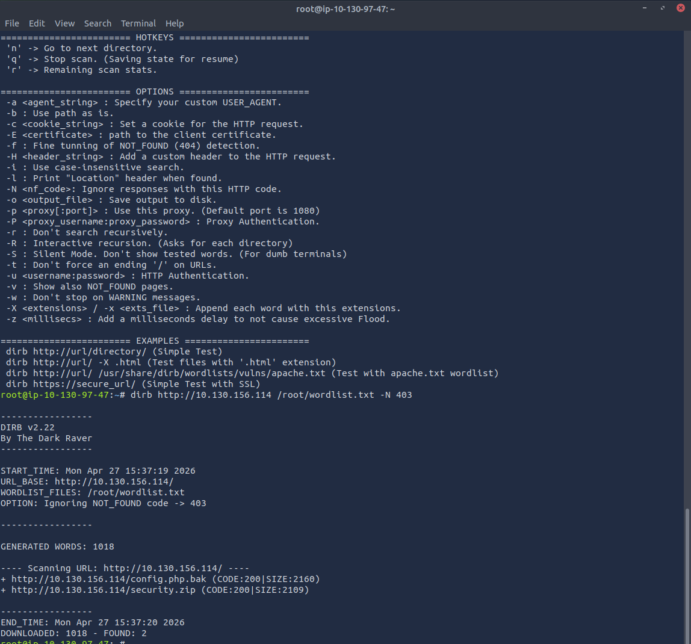

- **¿Cuál es el tamaño en bytes del fichero de mayor tamaño?**  
  El fichero de mayor tamaño encontrado tiene un tamaño de **2160 bytes**.

- **¿Cómo se llama el fichero que tiene un tamaño inferior al mayor?**  
  El fichero con un tamaño inferior al mayor se llama **SECURITY**.

---

## Apartado 3: Data Breach

### Contexto
Un **Data Breach** es un incidente de seguridad en el que información sensible o protegida es accedida, robada o expuesta sin autorización. Puede deberse a ataques externos, errores internos o configuraciones incorrectas. En este apartado se analiza la información filtrada del sistema de InGen.

### Preguntas y respuestas

- **¿Qué principio de la tríada CIA se ve afectado por un Data Breach de información?**  
  El principio afectado es la **Confidencialidad**, ya que la información privada queda expuesta a personas no autorizadas.

- **¿Cómo se llama la intranet?**  
  La intranet se llama **ingen_park_ops**.

- **¿Cómo se llama el host?**  
  El host se llama **localhost**.

- **¿Qué codificación se utiliza para las tablas?**  
  Las tablas utilizan la codificación **utf8mb4**, una variante extendida de UTF-8 que permite caracteres especiales y emojis.

- **¿Cuál es la AUTH_KEY del sistema?**  
  La AUTH_KEY del sistema es: `&D5bY9KL_lD(GDIePp*o&^~K`

- **¿Cuál es la SECURE_AUTH_KEY del sistema?**  
  La SECURE_AUTH_KEY del sistema es: `NR;@e/,/!cqzLP@+`C`

- **¿Cuál es el prefijo de la Base de datos?**  
  El prefijo de la base de datos es **ingen_**.

- **¿Qué fichero contiene las claves del parque?**  
  El fichero que contiene las claves del parque es **public_key.asc**.

---

## Apartado 4: Accionando Keys (GPG)

### Contexto
**GNU Privacy Guard (GPG)** es una herramienta de cifrado y firma digital que implementa el estándar OpenPGP. Permite cifrar archivos y mensajes para que solo el destinatario autorizado pueda leerlos, y firmar digitalmente datos para garantizar su autenticidad. Utiliza un sistema de clave pública y clave privada: la pública se comparte y la privada permanece en secreto.

  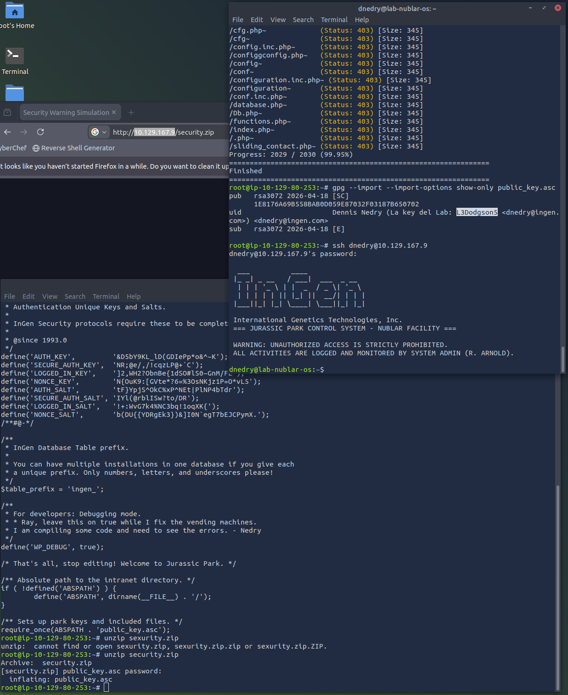

### Preguntas y respuestas

  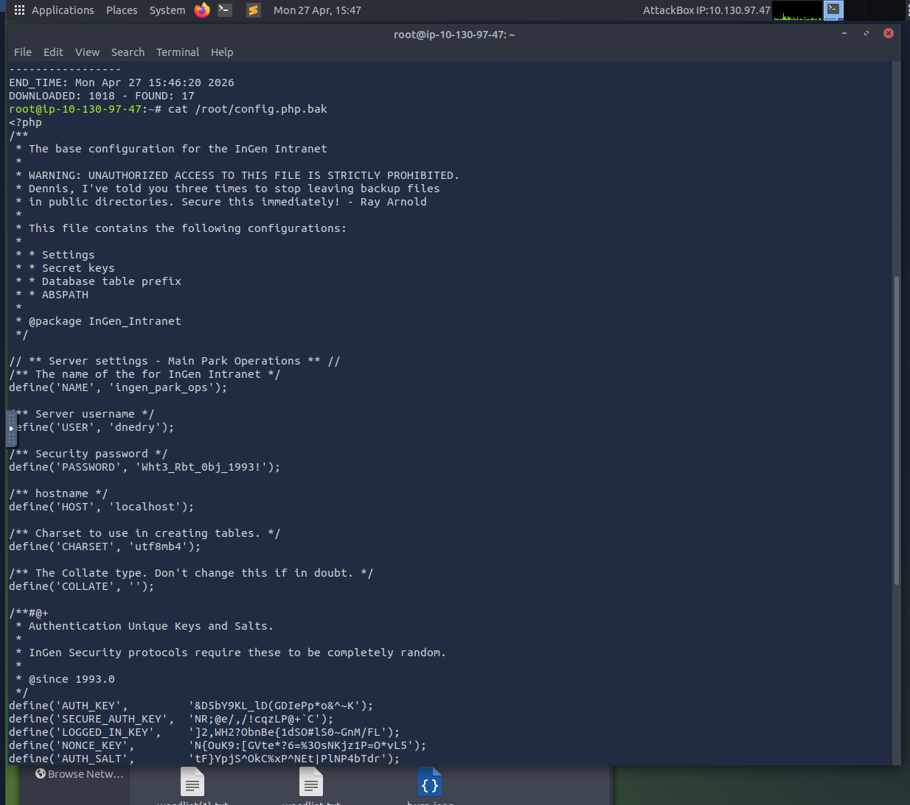
  Ese comando es básicamente como pedir un "vistazo previo".
  **--import:** Es la orden para añadir una llave
  **--import-options show-only:** Esta es la parte importante. Le dice a GPG: "Enséñame qué hay dentro de este archivo, pero no lo guardes todavía".
  **public_key.asc:** Es el archivo que contiene la llave pública. 
  

- **¿Cuál es la contraseña del fichero?**  
  La contraseña del fichero es: **`Wht3_Rbt_0bj_1993!`**

- **¿En qué está basado el fichero que se ha obtenido?**  
  El fichero está basado en el estándar **ASCII**.

- **¿Cuál es el inicio de la clave pública?**  
  La clave pública comienza con:  
  `mQGNBGnjWv4BDACqYvlAtc9o3Lve1YOUvgHphHCKyCLIy2swF1PDE0FR39n15H01`

- **¿Qué algoritmo de cifrado utiliza la clave pública?**  
  El algoritmo de cifrado utilizado es **RSA3072**, que corresponde a RSA con una longitud de clave de 3072 bits.

- **¿Cuándo fue creada?**  
  La clave fue creada el **18/04/2026**.

- **¿A quién pertenece?**  
  La clave pública pertenece a **Dennis Nedry**.

  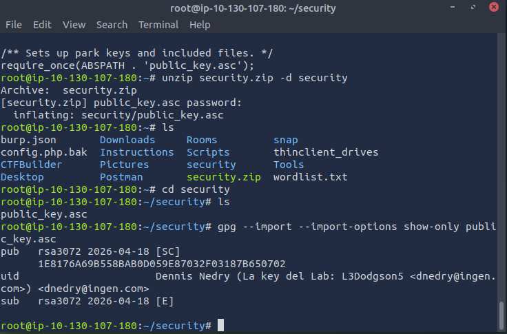

- **¿Cuál es su correo?**  
  El correo electrónico asociado es: **dnedry@ingen.com**

---

## Apartado 5: Accediendo al Host

### Contexto
Conocer en profundidad los usuarios del sistema es fundamental en ciberseguridad. Identificar quién tiene acceso, qué roles desempeña y qué permisos posee permite aplicar el principio de mínimo privilegio y detectar posibles vectores de ataque internos. Auditar usuarios, grupos y permisos es esencial para mantener la seguridad del sistema.

  
  
  **ssh:** Es el protocolo (Secure Shell) que crea un túnel cifrado para que nadie pueda espiar lo que escribes.
  **dnedry:** Es el nombre del usuario con el que intento identificarme en la otra máquina.
  **10.128.176.254:** Es la dirección IP de la "casa" (servidor o equipo) a la que me quiero conectar. 

### Preguntas y respuestas

- **¿Cuál es el administrador del sistema?**  
  El administrador del sistema es el usuario **dnedry**.

- **¿Cuál es su contraseña?**  
  La contraseña del administrador es: **`L3Dodgson5`**

- **¿A qué directorio se accede por defecto?**  
  Al iniciar sesión, se accede por defecto al directorio **/home/dnedry**.

- **¿Cuántos usuarios existen en el sistema?**  
  Existen **28** usuarios en el sistema.

    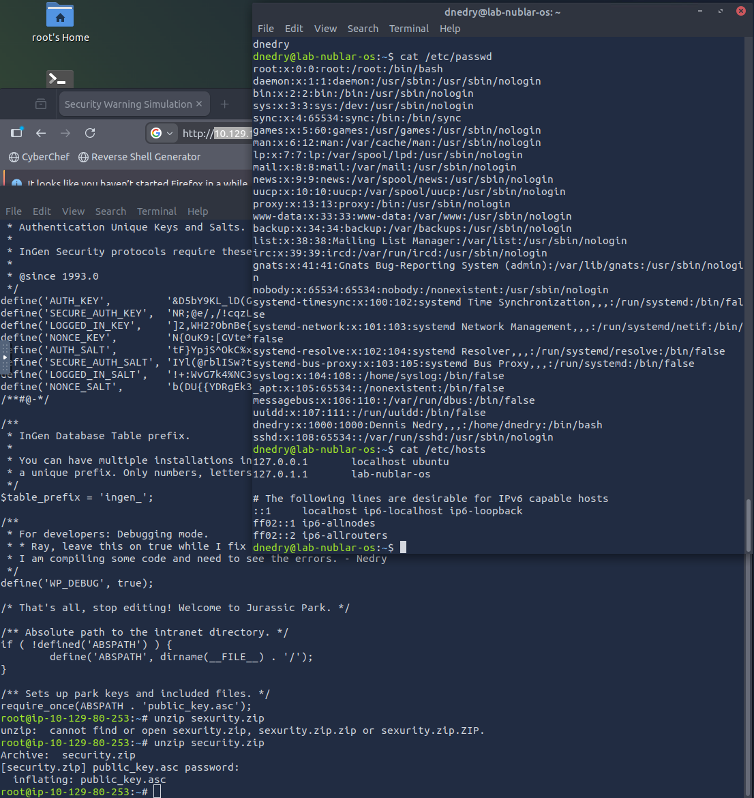
    **cat /etc/passwd**
    **cat:** Lee el contenido del archivo.
    **/etc/passwd:** Es el archivo que guarda la configuración básica de todos los usuarios del sistema.
    
- **¿Cuál es el nombre completo del usuario?**  
  El nombre completo del usuario es **Dennis Nedry**.

- **¿Quién es el encargado de monitorear todos los sistemas?**  
  El encargado de monitorear todos los sistemas es **R. Arnold**.

    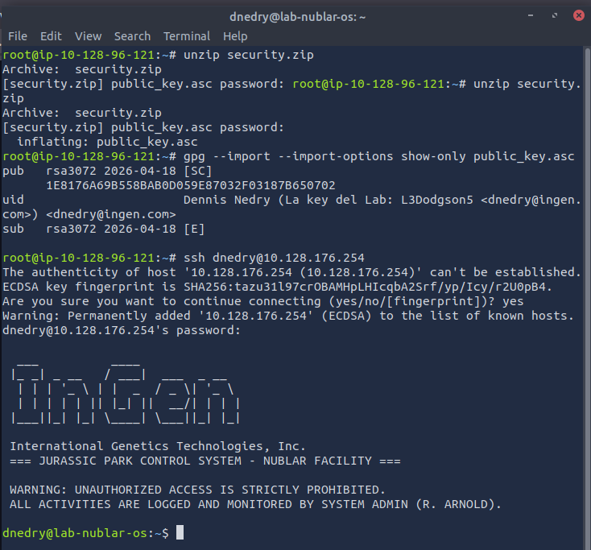
  

- **¿Cuál es el hostname?**  
  El hostname del sistema es **lab-nublar-os**.

- **Según la información del sistema, ¿en qué tipo de distribución está basado InGenOS?**  
  InGenOS está basado en una distribución de tipo **securityos**.

- **¿A qué grupos pertenece el usuario?**  
  El usuario `dnedry` pertenece a los siguientes grupos:  
  `dnedry`, `adm`, `cdrom`, `dip`, `plugdev`, `lpadmin`, `sambashare`

    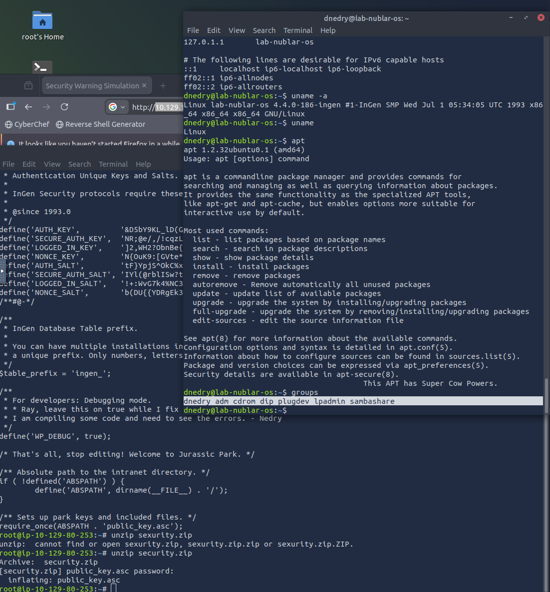

---

## Apartado 6: Análisis 101

### Contexto
Extraer información detallada del sistema es un paso clave en cualquier auditoría de seguridad. Conocer los puertos abiertos, los procesos en ejecución, el uso del disco, los binarios con permisos especiales y el estado del firewall permite identificar vulnerabilidades, configuraciones inseguras y posibles vectores de ataque o escalada de privilegios.

### Preguntas y respuestas

- **¿Cuántos puertos tiene abiertos la máquina?**  
  La máquina tiene **4** puertos abiertos.

    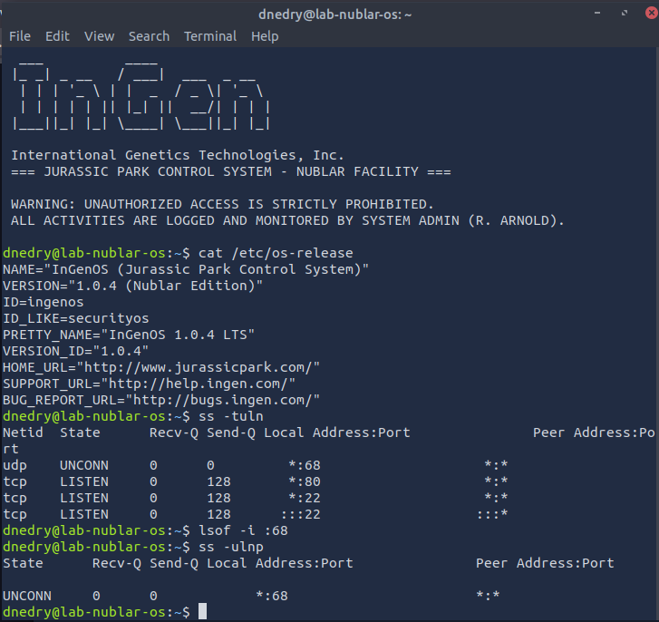
    **cat /etc/os-release** Este comando sirve para preguntarle al sistema: "¿Exactamente quién eres?".
    **cat:** Es la orden para "leer" o mostrar el contenido de un archivo por pantalla.
    **/etc/os-release:** Es el archivo donde el sistema guarda "datos de identidad".

- **¿Qué ha abierto el protocolo UDP?**  
  El protocolo UDP ha abierto **68** puertos.
  
    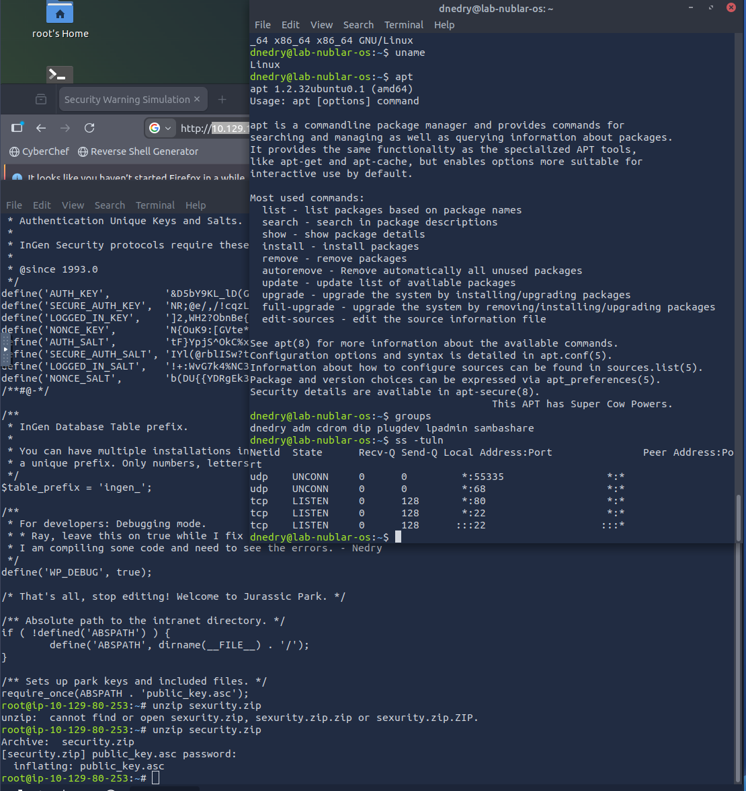
    **ss -tuln**
    Este comando es como mirar un tablero de control de las comunicaciones de la máquina. Sirve para ver qué "puertas" (puertos) tiene abiertas el ordenador hacia     el mundo.

  **ss:** Es la herramienta para investigar los "sockets" (conexiones de red). Es el sustituto moderno del antiguo comando netstat.
  **-t:** Muestra solo conexiones TCP (como las de las webs).
  **-u:** Muestra solo conexiones UDP (usadas en streaming o juegos).
  **-l:** Muestra solo los puertos que están escuchando (listening). Es decir, puertos que están esperando a que alguien se conecte a ellos.
  **-n:** Muestra todo en números. En lugar de decirte "puerto HTTP", dirá "puerto 80". Es mucho más rápido porque no pierde tiempo buscando nombres.

- **¿Qué porcentaje de disco está siendo usado por el sistema?**

    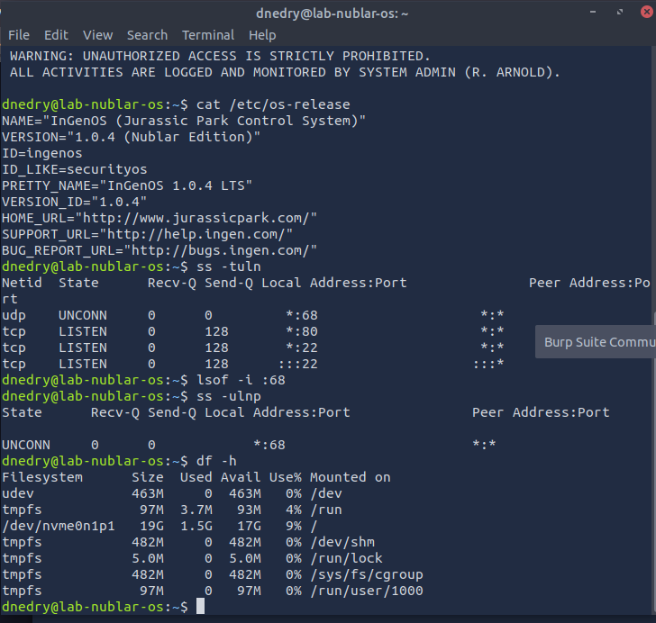

  El disco está siendo utilizado en un **9%**.

- **¿Cuántos GigaBytes hay disponibles en el disco del sistema?**  
  Hay **18 GB** disponibles en el disco del sistema.

    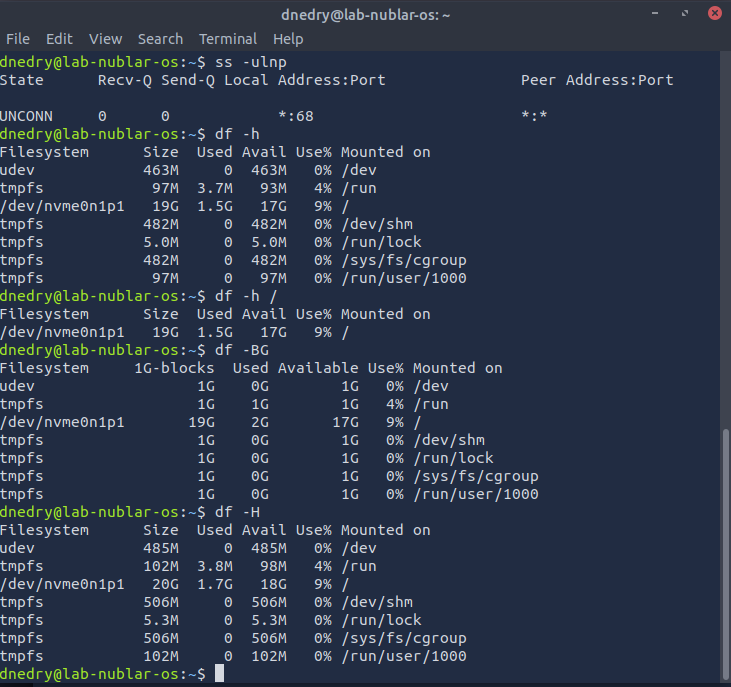

- **El usuario www-data, ¿qué proceso está ejecutando en el sistema?**  
  El usuario `www-data` está ejecutando el proceso:  
  `/usr/sbin/lighttpd -D -f /etc/lighttpd/lighttpd.conf`  
  Esto indica que el servidor web utilizado es **lighttpd**, ejecutándose en modo demonio.

    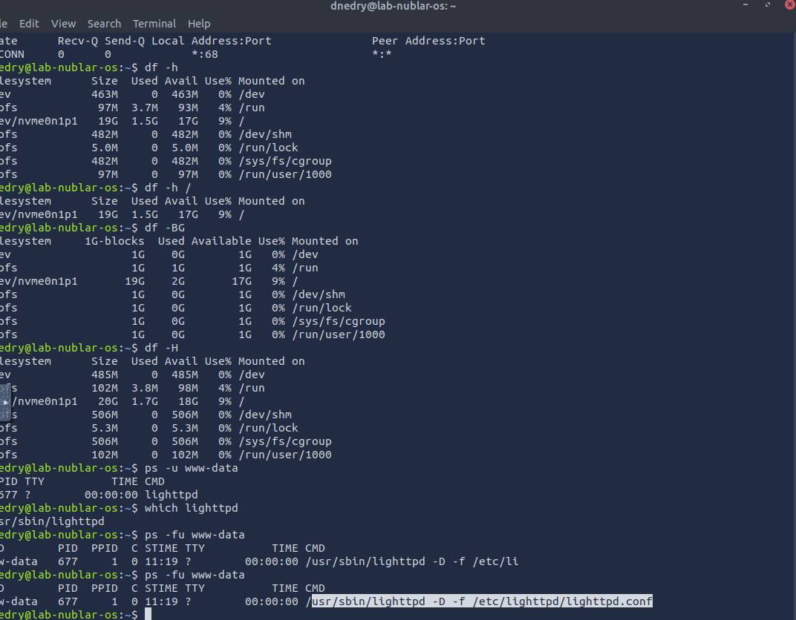
    **ps -fu www.data**
    Este comando sirve para "espiar" qué está haciendo el servidor web en este preciso momento.

    **ps:** Es la herramienta para ver los procesos (programas) que se están ejecutando.
    **-f:** (Full-format) Le pide al sistema todos los detalles: quién lanzó el programa, a qué hora empezó, qué comando exacto usó, etc.
    **-u www-data:** (User) Le dice: "Solo enséñame lo que está haciendo el usuario www-data".

- **¿Cuántos binarios con el bit SUID activo existen en el sistema?**  
  Existen **16** binarios con el bit SUID activo. El bit SUID permite que un binario se ejecute con los privilegios de su propietario (normalmente `root`), lo que puede suponer un riesgo si alguno de ellos es vulnerable.

    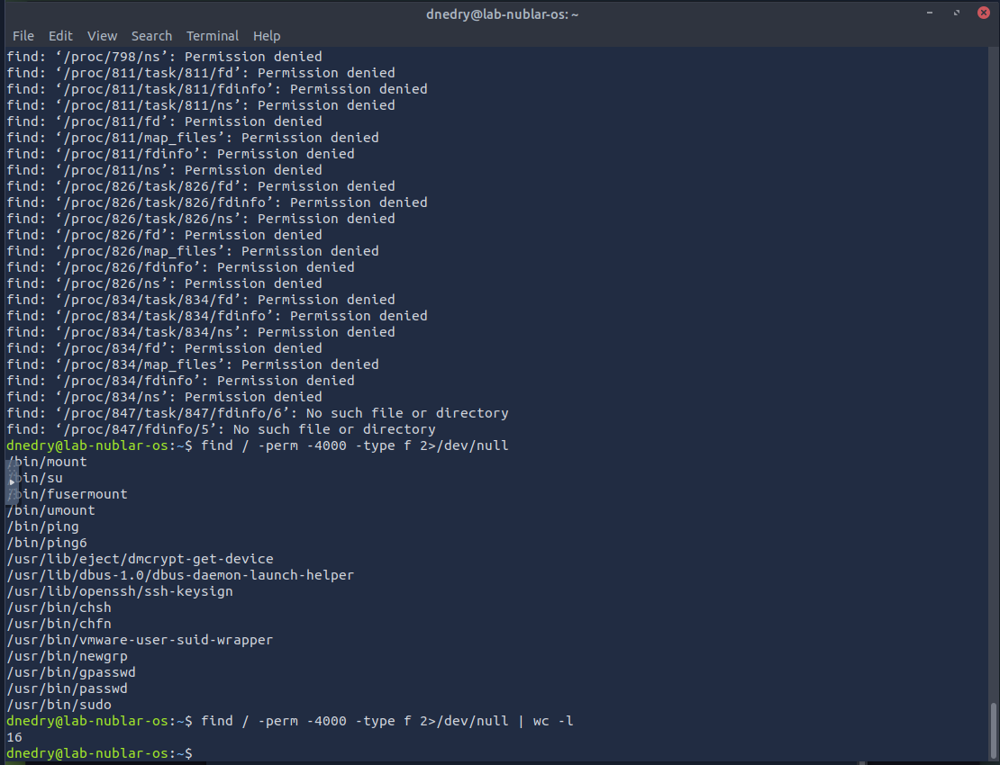
    Ese comando es como usar un detector de metales para buscar "superpoderes" escondidos.
    **find /:** Busca en todo el ordenador, desde la raíz.
    **-perm -4000:** Busca archivos que tengan activado el bit SUID (Set User ID). Archivos que, al ejecutarse, funcionan con los privilegios del dueño.
    **-type f:** Le dice que solo busque archivos normales, ignorando carpetas.
    **2>/dev/null:** Sirve para que la pantalla no se llene de mensajes de "Permiso denegado" en las carpetas donde no tienes acceso. Solo los resultados que importan
  

- **¿En qué estado se encuentra el firewall?**  
  El firewall se encuentra en estado **Active (exited)**. Esto significa que el servicio está activo pero ha finalizado su ejecución, lo que implica que las reglas se cargaron al inicio pero el proceso ya no está corriendo activamente, dejando potencialmente el sistema sin protección dinámica.

  Reconozco que con el tema FIREWALL perdí mucho tiempo porque el comando que yo usé, a pesar de que me daba la información que sí está bien, no me la mandaba en el mismo formato que obligaba la respuesta: incluyendo paréntesis. A si que estuve dándole muchas vueltas hasta conseguirlo.

   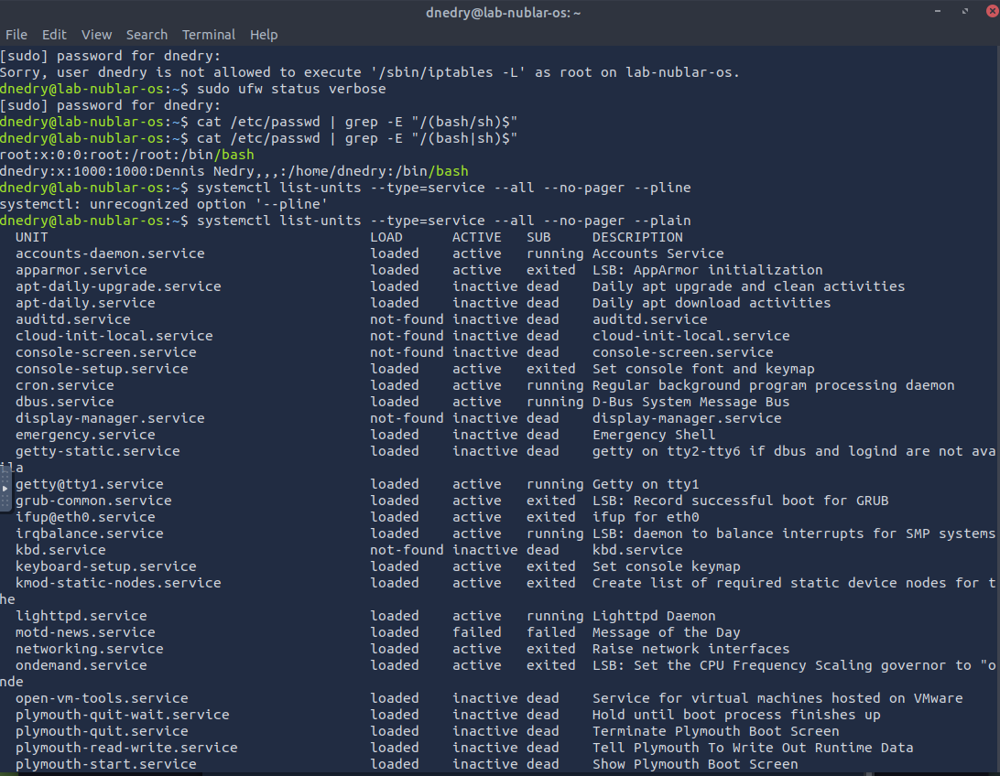
  **systemctl list-units --type=service --all --no-pager --plain**
  Este comando es como pedir una lista detallada de todos los motores (servicios) que tiene el sistema, para saber cuáles están funcionando y cuáles están         apagados.

  **systemctl list-units:** Es la orden principal para ver las "unidades" (tareas/servicios) que gestiona el sistema.
  **--type=service:** Filtra la lista para que solo muestre servicios (programas que corren de fondo), ignorando otras cosas como puntos de montaje o dispositivos.
  **--all:** Le dice que enseñe todo, incluso los servicios que han fallado o que están desactivados (por defecto, a veces solo muestra los activos).
  **--no-pager:** Evita que el resultado se corte y tener que ir bajando con el teclado. Suelta toda la información de golpe en la pantalla.
  **--plain:** Quita los colores y el formato bonito para que sea puro texto. Ideal para pasarle el resultado a otro comando para buscar palabras específicas.

   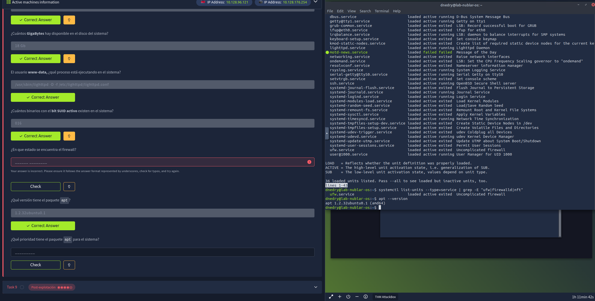

- **¿Qué versión tiene el paquete apt?**  
  La versión del paquete `apt` es **1.2.32ubuntu0.1**.

- **¿Qué prioridad tiene el paquete apt para el sistema?**  
  La prioridad del paquete `apt` para el sistema es **Important**.

---

## Conclusión

A lo largo de este reto se ha seguido una metodología de análisis progresiva: comenzando por el reconocimiento web, pasando por la enumeración de recursos con fuzzing, el análisis de datos filtrados, el descifrado de claves GPG, el acceso al sistema mediante credenciales encontradas y, finalmente, el análisis forense del estado del sistema.

El principal vector de ataque identificado fue la **mala configuración de permisos**, especialmente la presencia de binarios con el bit SUID activo, combinada con un firewall en estado inactivo que no ofrecía protección real. El usuario administrador **Dennis Nedry (`dnedry`)** tenía acceso a múltiples grupos con privilegios elevados, lo que facilitó la escalada hasta obtener acceso `root`.

Este ejercicio pone de manifiesto la importancia de **auditar regularmente los sistemas**, aplicar el **principio de mínimo privilegio** y mantener los **mecanismos de seguridad activos y correctamente configurados**.
